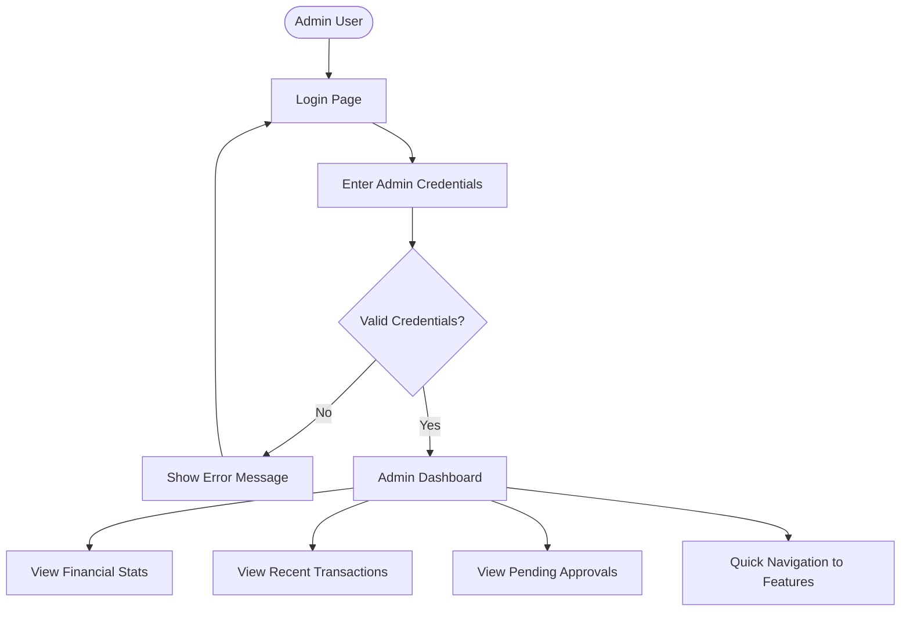

# FlashPoint User Journey Flows - Mermaid Diagrams

## Admin Flows

### 1. Admin - Login to Dashboard Flow

### 2. Admin - Pending Events Approval Flow

### 3. Admin - User Management Flow

### 4. Admin - Transactions Management Flow

### 5. Admin - GL Reports Flow

### 6. Admin - Bank Reconciliation Flow

### 7. Admin - Audit Logs Flow

---

## Treasurer Flows

### 1. Treasurer - Login to Dashboard Flow

### 2. Treasurer - Events Management Flow

### 3. Treasurer - Society Dues Management Flow

### 4. Treasurer - Payment Tracking Flow

### 5. Treasurer - Event Details & QR Code Sharing Flow

---

## Usage Instructions

### How to Use These Mermaid Diagrams:

1. **Copy the code block** for the flow you want to visualize
2. **Paste it into any Mermaid-compatible tool**:
   - Mermaid Live Editor: https://mermaid.live/
   - GitHub (in .md files)
   - Notion (with Mermaid blocks)
   - GitLab
   - Documentation tools (Docusaurus, MkDocs, etc.)

3. **The diagram will render automatically** showing the complete user journey

### Flow Structure:
- **Rectangle**: Process/Action step
- **Diamond**: Decision point
- **Rounded Rectangle**: Start/End points
- **Arrows**: Flow direction

### Color Coding (optional):
You can add colors by modifying the mermaid code with `style` commands at the end of each diagram.

